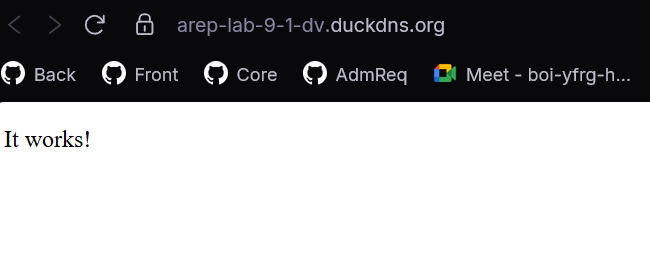
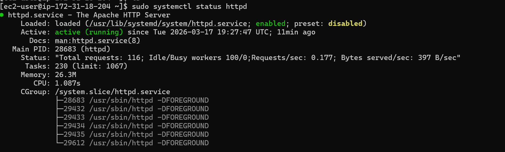
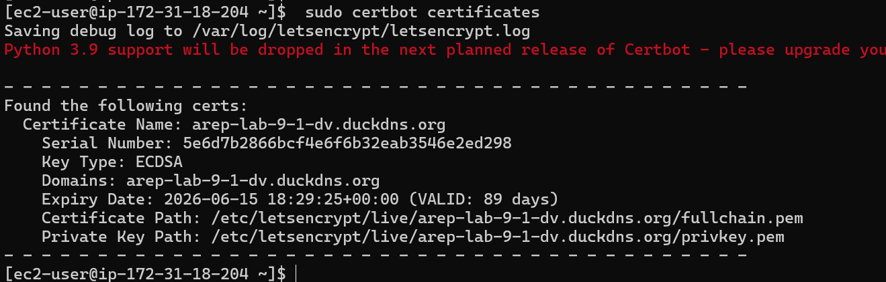
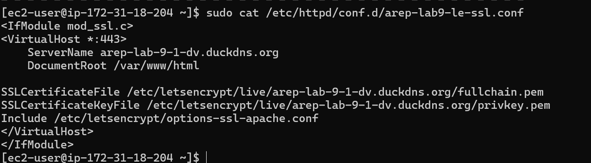
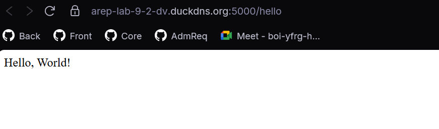
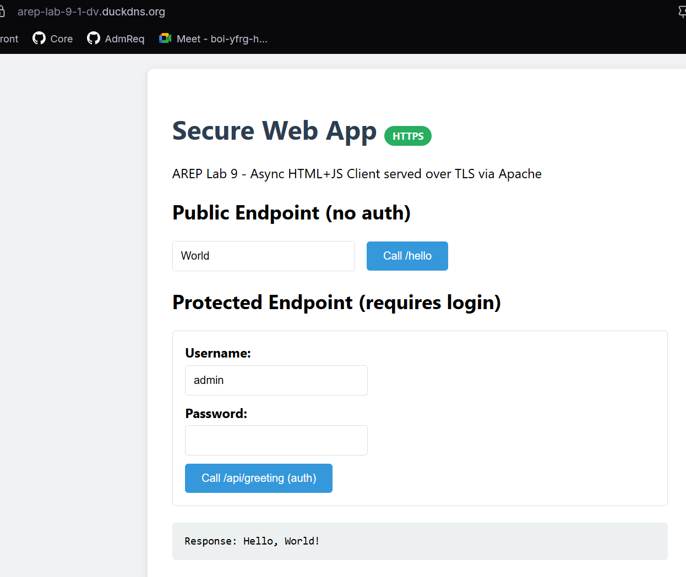
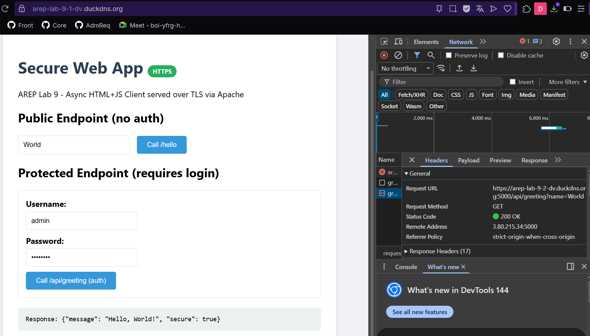

# AREP Lab 9 - Secure Application Design

**Author:** David Velasquez

## Description

This project implements a secure, scalable web application deployed on AWS with two EC2 instances. The architecture features an **Apache server** serving an async HTML+JavaScript client over HTTPS, and a **Spring Boot backend** providing RESTful API endpoints also over HTTPS. Both servers use real TLS certificates from **Let's Encrypt** via **Certbot**, with DNS managed through **DuckDNS**.

### Key Security Features

- **TLS Encryption**: Real Let's Encrypt certificates on both servers
- **Asynchronous Client**: HTML+JS frontend uses `fetch()` API for async communication
- **Login Security**: Passwords stored as BCrypt hashes via Spring Security
- **AWS Deployment**: Two separate EC2 instances for front and back

## Architecture

```
                         HTTPS (port 443)
    Browser  ──────────────────────────────►  EC2: Front (Apache)
                                               arep-lab-9-1-dv.duckdns.org
                                               54.235.14.247
                                               Serves: index.html (async JS)
                                                        │
                                                        │ fetch() calls
                                                        │ HTTPS (port 5000)
                                                        ▼
                                               EC2: Back (Spring Boot)
                                               arep-lab-9-2-dv.duckdns.org
                                               3.80.215.34
                                               REST API + Login (BCrypt)
```

### Component Details

| Component | Technology | Domain | Port | TLS |
|---|---|---|---|---|
| Frontend | Apache httpd + HTML/JS | arep-lab-9-1-dv.duckdns.org | 443 | Let's Encrypt (Certbot) |
| Backend | Spring Boot 3.2.5 | arep-lab-9-2-dv.duckdns.org | 5000 | Let's Encrypt → PKCS12 keystore |

### Class Diagram (Backend)

```
┌───────────────────────────┐
│  SecurewebApplication     │  (Main entry point)
│  + main()                 │
│  + getPort()              │  Reads PORT from env
└───────────┬───────────────┘
            │ starts
            ▼
┌───────────────────────────┐     ┌────────────────────────┐
│  Spring Boot / Tomcat     │     │  SecurityConfig        │
│  Port: 5000 (HTTPS)       │◄────│  + passwordEncoder()   │  BCryptPasswordEncoder
│  KeyStore: ecikeystore.p12│     │  + userDetailsService()│  admin / arep2026 (hashed)
└───────────┬───────────────┘     │  + filterChain()       │  /, /hello = public
            │ routes              │                        │  /api/** = authenticated
            ▼                     └────────────────────────┘
┌───────────────────────────┐
│  HelloController          │
│  @RestController          │
│  @CrossOrigin(origins="*")│
│                           │
│  GET /                    │  → "Greetings from Spring Boot (Secure)!"
│  GET /hello?name=X        │  → "Hello, X!" (public)
│  GET /api/greeting?name=X │  → JSON response (requires Basic Auth)
└───────────────────────────┘
```

## Project Structure

```
AREP-Lab-9/
├── secureweb-back/                    # Spring Boot backend
│   ├── pom.xml
│   └── src/main/
│       ├── java/com/example/
│       │   ├── SecurewebApplication.java
│       │   ├── HelloController.java
│       │   └── SecurityConfig.java
│       └── resources/
│           ├── application.properties
│           └── keystore/ecikeystore.p12
├── secureweb-front/                   # Apache frontend
│   └── index.html
├── screenshots/
└── TallerAllSecureAppSpring.pdf
```

## Prerequisites

- Java 17 or higher
- Maven 3.x
- AWS account with 2 EC2 instances (Amazon Linux 2023)
- DuckDNS account (free subdomains)

## How to Build (Backend)

```bash
cd secureweb-back
mvn clean package -DskipTests
```

### Generate a local self-signed keystore (for development)

```bash
keytool -genkeypair -alias ecikeypair -keyalg RSA -keysize 2048 \
  -storetype PKCS12 -keystore src/main/resources/keystore/ecikeystore.p12 \
  -validity 3650 -storepass 123456 \
  -dname "CN=localhost, OU=AREP, O=ECI, L=Bogota, ST=Bogota DC, C=CO"
```

### Run locally

```bash
java -jar target/secureweb-1.0-SNAPSHOT.jar
```

Then visit: `https://localhost:5000/hello` (browser will warn about self-signed cert, that's normal for local dev).

## AWS Deployment

### Step 1: DuckDNS Setup

1. Go to [duckdns.org](https://www.duckdns.org) and sign in
2. Create two subdomains pointing to your EC2 public IPs:
   - `arep-lab-9-1-dv.duckdns.org` → Front IP (54.235.14.247)
   - `arep-lab-9-2-dv.duckdns.org` → Back IP (3.80.215.34)

### Step 2: Front Server (Apache + Let's Encrypt)

```bash
ssh -i "AppServerKey.pem" ec2-user@54.235.14.247
```

```bash
# Install Apache + mod_ssl
sudo yum update -y
sudo yum install -y httpd mod_ssl

# Start Apache
sudo systemctl start httpd
sudo systemctl enable httpd

# Create VirtualHost
sudo tee /etc/httpd/conf.d/arep-lab9.conf > /dev/null << 'EOF'
<VirtualHost *:80>
    ServerName arep-lab-9-1-dv.duckdns.org
    DocumentRoot /var/www/html
</VirtualHost>
EOF
sudo systemctl restart httpd

# Install Certbot
sudo yum install -y augeas-devel gcc python3-devel python3-pip
sudo python3 -m venv /opt/certbot
sudo /opt/certbot/bin/pip install --upgrade pip
sudo /opt/certbot/bin/pip install certbot certbot-apache
sudo ln -sf /opt/certbot/bin/certbot /usr/bin/certbot

# Generate Let's Encrypt certificate
sudo certbot --apache -d arep-lab-9-1-dv.duckdns.org \
  --non-interactive --agree-tos --email your-email@example.com --redirect

# Deploy frontend
sudo cp index.html /var/www/html/index.html
```

### Step 3: Back Server (Spring Boot + Let's Encrypt)

```bash
ssh -i "AppServerKey.pem" ec2-user@3.80.215.34
```

```bash
# Install Java + Maven
sudo yum update -y
sudo yum install -y java-17-amazon-corretto-devel maven git

# Install Certbot (standalone mode, no Apache needed)
sudo yum install -y augeas-devel gcc python3-devel python3-pip
sudo python3 -m venv /opt/certbot
sudo /opt/certbot/bin/pip install --upgrade pip
sudo /opt/certbot/bin/pip install certbot
sudo ln -sf /opt/certbot/bin/certbot /usr/bin/certbot

# Generate Let's Encrypt certificate
sudo certbot certonly --standalone -d arep-lab-9-2-dv.duckdns.org \
  --non-interactive --agree-tos --email your-email@example.com

# Convert Let's Encrypt cert to PKCS12 keystore for Spring Boot
sudo openssl pkcs12 -export \
  -in /etc/letsencrypt/live/arep-lab-9-2-dv.duckdns.org/fullchain.pem \
  -inkey /etc/letsencrypt/live/arep-lab-9-2-dv.duckdns.org/privkey.pem \
  -out ~/ecikeystore.p12 -name ecikeypair -passout pass:123456

# Copy keystore into project and build
cp ~/ecikeystore.p12 secureweb/src/main/resources/keystore/
cd secureweb
mvn clean package -DskipTests

# Run Spring Boot
nohup java -jar target/secureweb-1.0-SNAPSHOT.jar > /tmp/spring.log 2>&1 &
```

### Step 4: Security Groups

Open the following ports in your EC2 Security Groups:

| Instance | Port | Protocol | Source |
|---|---|---|---|
| Front | 80 | TCP | 0.0.0.0/0 |
| Front | 443 | TCP | 0.0.0.0/0 |
| Back | 5000 | TCP | 0.0.0.0/0 |

### Step 5: Test

- Frontend: https://arep-lab-9-1-dv.duckdns.org
- Backend public: https://arep-lab-9-2-dv.duckdns.org:5000/hello
- Backend auth: https://arep-lab-9-2-dv.duckdns.org:5000/api/greeting?name=Test (user: `admin`, pass: `arep2026`)

## Security Implementation Details

### TLS Certificates

Both servers use **Let's Encrypt** certificates (not self-signed), providing real CA-validated TLS:

- **Front (Apache)**: Certbot installs the certificate directly into Apache's SSL config via `certbot --apache`
- **Back (Spring Boot)**: Certbot generates PEM files, which are converted to a PKCS12 keystore using `openssl pkcs12 -export` for Spring Boot compatibility

### Password Hashing

Passwords are stored as **BCrypt hashes** using Spring Security's `BCryptPasswordEncoder`. The hash is generated at runtime, never stored in plain text:

```java
@Bean
public PasswordEncoder passwordEncoder() {
    return new BCryptPasswordEncoder();
}

UserDetails user = User.builder()
    .username("admin")
    .password(passwordEncoder().encode("arep2026"))  // BCrypt hash
    .roles("USER")
    .build();
```

### Authorization

- `GET /` and `GET /hello` are **public** (no authentication required)
- `GET /api/**` endpoints require **HTTP Basic Auth** with valid credentials

## Evidence

### HTTPS working on Frontend (Apache + Let's Encrypt)



### Apache service running on EC2



### Let's Encrypt certificate details



### Apache SSL VirtualHost configuration



### Spring Boot backend responding over HTTPS



### Frontend calling backend (async JS)



### Authenticated endpoint (/api/greeting)



## Built With

- Java 17 (Amazon Corretto)
- Spring Boot 3.2.5
- Spring Security (BCrypt)
- Apache httpd + mod_ssl
- Let's Encrypt + Certbot
- DuckDNS
- AWS EC2 (Amazon Linux 2023)
